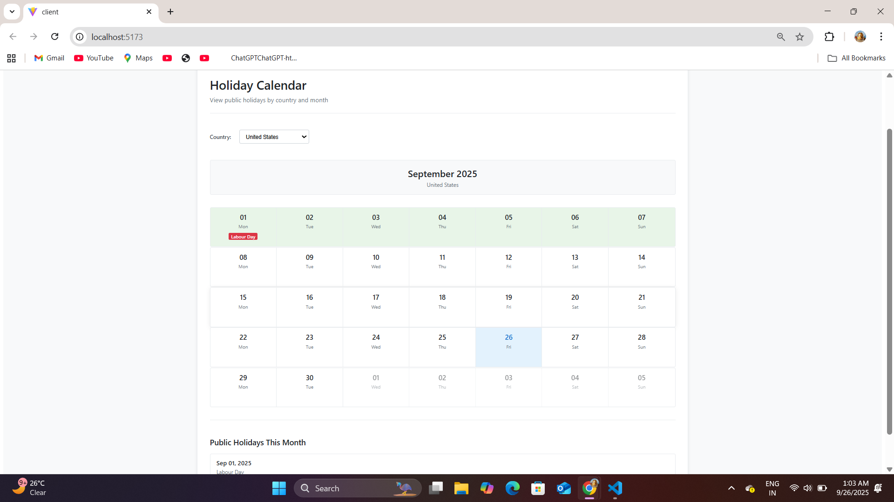
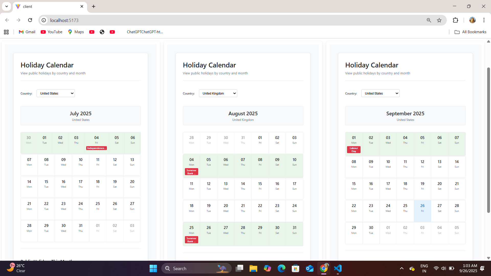

# 🌍 Vacation Calendar

A dynamic vacation calendar that highlights holidays weekly, built using the **MERN stack** and integrates with a public holiday API for multiple countries.

---

## 📖 About
This project is a **full-stack vacation calendar** that allows users to view holidays in **monthly and quarterly views**.  
- Weeks with **1 holiday** are highlighted **light green**.  
- Weeks with **multiple holidays** are highlighted **dark green**.  
- Each holiday day shows its name and an icon 🎉.  

The app supports multiple countries such as **US, UK, and India**, making it globally flexible.

---

## 🚀 Features
- 🌐 **Multi-country support** for holidays (US, UK, IN, etc.)  
- 📅 **Monthly and quarterly views** of holidays  
- 🟢 **Week-based highlighting**:  
  - 1 holiday → light green  
  - Multiple holidays → dark green  
- 🎉 Holiday days display names and icons  
- 🛠️ Fully **responsive and professional UI**  

---

## 🛠️ Tech Stack

- [Express.js](https://expressjs.com/) – Backend API server  
- [React](https://react.dev/) – Frontend UI  
- [Node.js](https://nodejs.org/) – Backend runtime  
- [Axios](https://axios-http.com/) – Fetching holiday data from API  
- [date-fns](https://date-fns.org/) – Date calculations for weeks/months  

---

## 📸 Screenshots

### 🟢 Week with Single Holiday

### 🟢🟢 Week with Multiple Holidays

## 👨‍💻 Author
- Yuvraj Soni  
- [LinkedIn](https://www.linkedin.com/in/yuvraj-soni-73ab60253/) | [GitHub](https://github.com/YUVRAJsoni999)

